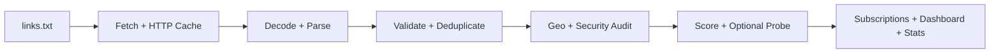

<div align="center" dir="rtl">

<a href="https://pouria08.github.io/popvpn1/">
  
</a>

# ⚡ POPVPN X

### هاب هوشمند سابسکریپشن‌های VPN — مرتب، قابل‌استفاده و همیشه در حال به‌روزرسانی


<p>
  <a href="https://raw.githubusercontent.com/pouria08/popvpn1/main/base64.txt"></a>
  <a href="https://pouria08.github.io/popvpn1/"></a>
  <a href="https://github.com/pouria08/popvpn1/actions"></a>
</p>

<p>
  
  
  
  
</p>

</div>

> [!IMPORTANT]
> این پروژه کانفیگ‌هایی را که **به‌صورت عمومی منتشر شده‌اند** جمع‌آوری و مرتب می‌کند. هیچ کانفیگی تضمین دائمی ندارد. برای انتخاب مطمئن‌تر، ابتدا خروجی **Verified** (پس از اجرای probe) و سپس **Best** را امتحان کنید؛ قوانین محل زندگی خود را هم رعایت کنید.

---

## ✨ از کجا شروع کنم؟

| اگر شما… | این خروجی را انتخاب کنید | چرا؟ |
|:---|:---|:---|
| از **Hiddify / v2rayNG / Streisand** استفاده می‌کنید | [Base64 Subscription](https://raw.githubusercontent.com/pouria08/popvpn1/main/base64.txt) | یک لینک برای بیشتر کلاینت‌های رایج |
| از **Clash Meta / Clash Verge Rev / Mihomo** استفاده می‌کنید | [clash.yaml](https://raw.githubusercontent.com/pouria08/popvpn1/main/outputs/clash.yaml) | پروفایل آمادهٔ Clash/Mihomo |
| از **sing-box** استفاده می‌کنید | [singbox.json](https://raw.githubusercontent.com/pouria08/popvpn1/main/outputs/singbox.json) | فایل import آمادهٔ sing-box |
| می‌خواهید تعداد کمتری کانفیگ با رتبهٔ بهتر داشته باشید | [best.txt](https://raw.githubusercontent.com/pouria08/popvpn1/main/outputs/best.txt) | مرتب‌شده بر اساس امتیاز کیفیت |
| فقط نودهای بررسی‌شده می‌خواهید | [verified.txt](https://raw.githubusercontent.com/pouria08/popvpn1/main/outputs/verified.txt) | فقط نتیجه‌های موفقِ آخرین probe؛ ممکن است بدون probe خالی باشد |
| می‌خواهید وضعیت سرویس را ببینید | [داشبورد زنده](https://pouria08.github.io/popvpn1/) | آمار، منابع، کیفیت و روند به‌روزرسانی |

<details open>
<summary><b>📋 لینک‌های اصلی — برای بازکردن یا کپی‌کردن</b></summary>

> روی نام فایل کلیک کنید تا باز شود؛ برای کپی دقیق، URL مقابل آن را انتخاب و کپی کنید. GitHub برای امنیت، JavaScript و دکمهٔ کپیِ سفارشی را در README اجرا نمی‌کند؛ به همین دلیل همهٔ آدرس‌ها به‌صورت متن هم آورده شده‌اند.

| خروجی | مناسب برای | URL مستقیم |
|:---|:---|:---|
| [Base64 Subscription](https://raw.githubusercontent.com/pouria08/popvpn1/main/base64.txt) | Hiddify، v2rayNG، Streisand و اکثر کلاینت‌ها | `https://raw.githubusercontent.com/pouria08/popvpn1/main/base64.txt` |
| [Plain Subscription](https://raw.githubusercontent.com/pouria08/popvpn1/main/working_configs.txt) | کلاینت‌هایی که URI خام می‌پذیرند | `https://raw.githubusercontent.com/pouria08/popvpn1/main/working_configs.txt` |
| [All / Plain](https://raw.githubusercontent.com/pouria08/popvpn1/main/outputs/all.txt) | نسخهٔ کامل plain در پوشهٔ خروجی | `https://raw.githubusercontent.com/pouria08/popvpn1/main/outputs/all.txt` |
| [All / Base64](https://raw.githubusercontent.com/pouria08/popvpn1/main/outputs/all_base64.txt) | نسخهٔ کامل Base64 | `https://raw.githubusercontent.com/pouria08/popvpn1/main/outputs/all_base64.txt` |
| [Best / Plain](https://raw.githubusercontent.com/pouria08/popvpn1/main/outputs/best.txt) | ۱۰۰ کانفیگ برتر | `https://raw.githubusercontent.com/pouria08/popvpn1/main/outputs/best.txt` |
| [Best / Base64](https://raw.githubusercontent.com/pouria08/popvpn1/main/outputs/best_base64.txt) | بهترین‌ها برای کلاینت‌های Base64 | `https://raw.githubusercontent.com/pouria08/popvpn1/main/outputs/best_base64.txt` |
| [Verified / Plain](https://raw.githubusercontent.com/pouria08/popvpn1/main/outputs/verified.txt) | فقط نتیجه‌های موفق probe | `https://raw.githubusercontent.com/pouria08/popvpn1/main/outputs/verified.txt` |
| [Verified / Base64](https://raw.githubusercontent.com/pouria08/popvpn1/main/outputs/verified_base64.txt) | verified برای کلاینت‌های Base64 | `https://raw.githubusercontent.com/pouria08/popvpn1/main/outputs/verified_base64.txt` |
| [Clash / Mihomo](https://raw.githubusercontent.com/pouria08/popvpn1/main/outputs/clash.yaml) | Clash Meta، Clash Verge Rev، Mihomo | `https://raw.githubusercontent.com/pouria08/popvpn1/main/outputs/clash.yaml` |
| [sing-box](https://raw.githubusercontent.com/pouria08/popvpn1/main/outputs/singbox.json) | sing-box و کلاینت‌های مبتنی بر آن | `https://raw.githubusercontent.com/pouria08/popvpn1/main/outputs/singbox.json` |
| [Statistics](https://raw.githubusercontent.com/pouria08/popvpn1/main/stats.txt) | گزارش انسانی آخرین اجرا | `https://raw.githubusercontent.com/pouria08/popvpn1/main/stats.txt` |
| [Machine-readable stats](https://raw.githubusercontent.com/pouria08/popvpn1/main/outputs/stats.json) | توسعه‌دهنده‌ها و مانیتورینگ | `https://raw.githubusercontent.com/pouria08/popvpn1/main/outputs/stats.json` |
| [Source health](https://raw.githubusercontent.com/pouria08/popvpn1/main/outputs/sources.json) | سلامت و پایداری منابع | `https://raw.githubusercontent.com/pouria08/popvpn1/main/outputs/sources.json` |

</details>

<details>
<summary><b>🧩 ساب‌لینک‌های تفکیک‌شده بر اساس پروتکل</b></summary>

هر دو نسخهٔ **Plain** و **Base64** تولید می‌شوند. اگر در یک اجرای خاص هیچ کانفیگی برای پروتکل وجود نداشته باشد، فایل مربوطه خالی است اما لینک ثابت می‌ماند.

| پروتکل | Plain | Base64 |
|:---|:---|:---|
| VLESS | [بازکردن](https://raw.githubusercontent.com/pouria08/popvpn1/main/outputs/by-protocol/vless.txt) · `…/by-protocol/vless.txt` | [بازکردن](https://raw.githubusercontent.com/pouria08/popvpn1/main/outputs/by-protocol/vless_base64.txt) · `…/by-protocol/vless_base64.txt` |
| VMess | [بازکردن](https://raw.githubusercontent.com/pouria08/popvpn1/main/outputs/by-protocol/vmess.txt) · `…/by-protocol/vmess.txt` | [بازکردن](https://raw.githubusercontent.com/pouria08/popvpn1/main/outputs/by-protocol/vmess_base64.txt) · `…/by-protocol/vmess_base64.txt` |
| Trojan | [بازکردن](https://raw.githubusercontent.com/pouria08/popvpn1/main/outputs/by-protocol/trojan.txt) · `…/by-protocol/trojan.txt` | [بازکردن](https://raw.githubusercontent.com/pouria08/popvpn1/main/outputs/by-protocol/trojan_base64.txt) · `…/by-protocol/trojan_base64.txt` |
| Shadowsocks | [بازکردن](https://raw.githubusercontent.com/pouria08/popvpn1/main/outputs/by-protocol/ss.txt) · `…/by-protocol/ss.txt` | [بازکردن](https://raw.githubusercontent.com/pouria08/popvpn1/main/outputs/by-protocol/ss_base64.txt) · `…/by-protocol/ss_base64.txt` |
| TUIC | [بازکردن](https://raw.githubusercontent.com/pouria08/popvpn1/main/outputs/by-protocol/tuic.txt) · `…/by-protocol/tuic.txt` | [بازکردن](https://raw.githubusercontent.com/pouria08/popvpn1/main/outputs/by-protocol/tuic_base64.txt) · `…/by-protocol/tuic_base64.txt` |
| Hysteria2 | [بازکردن](https://raw.githubusercontent.com/pouria08/popvpn1/main/outputs/by-protocol/hy2.txt) · `…/by-protocol/hy2.txt` | [بازکردن](https://raw.githubusercontent.com/pouria08/popvpn1/main/outputs/by-protocol/hy2_base64.txt) · `…/by-protocol/hy2_base64.txt` |
| WireGuard | [بازکردن](https://raw.githubusercontent.com/pouria08/popvpn1/main/outputs/by-protocol/wireguard.txt) · `…/by-protocol/wireguard.txt` | [بازکردن](https://raw.githubusercontent.com/pouria08/popvpn1/main/outputs/by-protocol/wireguard_base64.txt) · `…/by-protocol/wireguard_base64.txt` |

<details>
<summary><b>📋 آدرس کامل همهٔ پروتکل‌ها برای کپی</b></summary>

```text
https://raw.githubusercontent.com/pouria08/popvpn1/main/outputs/by-protocol/vless.txt
https://raw.githubusercontent.com/pouria08/popvpn1/main/outputs/by-protocol/vless_base64.txt
https://raw.githubusercontent.com/pouria08/popvpn1/main/outputs/by-protocol/vmess.txt
https://raw.githubusercontent.com/pouria08/popvpn1/main/outputs/by-protocol/vmess_base64.txt
https://raw.githubusercontent.com/pouria08/popvpn1/main/outputs/by-protocol/trojan.txt
https://raw.githubusercontent.com/pouria08/popvpn1/main/outputs/by-protocol/trojan_base64.txt
https://raw.githubusercontent.com/pouria08/popvpn1/main/outputs/by-protocol/ss.txt
https://raw.githubusercontent.com/pouria08/popvpn1/main/outputs/by-protocol/ss_base64.txt
https://raw.githubusercontent.com/pouria08/popvpn1/main/outputs/by-protocol/tuic.txt
https://raw.githubusercontent.com/pouria08/popvpn1/main/outputs/by-protocol/tuic_base64.txt
https://raw.githubusercontent.com/pouria08/popvpn1/main/outputs/by-protocol/hy2.txt
https://raw.githubusercontent.com/pouria08/popvpn1/main/outputs/by-protocol/hy2_base64.txt
https://raw.githubusercontent.com/pouria08/popvpn1/main/outputs/by-protocol/wireguard.txt
https://raw.githubusercontent.com/pouria08/popvpn1/main/outputs/by-protocol/wireguard_base64.txt
```

</details>

</details>

<details>
<summary><b>🌍 ساب‌لینک‌های کشورها</b></summary>

فایل‌های هر کشور در مسیر [`outputs/by-country/`](https://github.com/pouria08/popvpn1/tree/main/outputs/by-country) قرار می‌گیرند؛ برای نمونه:

```text
https://raw.githubusercontent.com/pouria08/popvpn1/main/outputs/by-country/de.txt
https://raw.githubusercontent.com/pouria08/popvpn1/main/outputs/by-country/us.txt
https://raw.githubusercontent.com/pouria08/popvpn1/main/outputs/by-country/ir.txt
https://raw.githubusercontent.com/pouria08/popvpn1/main/outputs/by-country/global.txt
```

فهرست **کامل و قابل‌کپیِ کشورهایی که در آخرین اجرا وجود دارند** به‌صورت خودکار در بخش «وضعیت زنده» پایین همین README ساخته می‌شود تا همیشه با خروجی‌ها همگام بماند.

</details>

---

## 📱 کلاینت‌های پیشنهادی

<details open>
<summary><b>🤖 Android</b></summary>

| برنامه | خروجی مناسب |
|:---|:---|
| [Hiddify](https://github.com/hiddify/hiddify-app) | Base64 Subscription |
| [v2rayNG](https://github.com/2dust/v2rayNG) | Base64، VLESS، VMess |
| [NekoBox for Android](https://github.com/MatsuriDayo/NekoBoxForAndroid) | sing-box |
| [Clash Meta for Android](https://github.com/MetaCubeX/ClashMetaForAndroid) | Clash / Mihomo |

</details>

<details>
<summary><b>🍎 iPhone / iPad</b></summary>

| برنامه | خروجی مناسب |
|:---|:---|
| [Streisand](https://apps.apple.com/app/streisand/id6450534064) | Base64، VLESS، VMess، Trojan |
| [Shadowrocket](https://apps.apple.com/app/shadowrocket/id932747118) | Base64 یا Clash |
| [FoXray](https://apps.apple.com/app/foxray/id6448898396) | Base64، VLESS، VMess، Trojan |
| [Hiddify](https://github.com/hiddify/hiddify-app) | Base64 Subscription |

</details>

<details>
<summary><b>🖥 Windows / Linux / macOS و روتر</b></summary>

| برنامه | خروجی مناسب |
|:---|:---|
| [Clash Verge Rev](https://github.com/clash-verge-rev/clash-verge-rev) | `clash.yaml` |
| [v2rayN](https://github.com/2dust/v2rayN) | Base64 Subscription |
| [Mihomo Party](https://github.com/mihomo-party-org/mihomo-party) | `clash.yaml` |
| [sing-box](https://github.com/SagerNet/sing-box) | `singbox.json` |
| [OpenClash](https://github.com/vernesong/OpenClash) | `clash.yaml` برای OpenWrt |

</details>

---

## 📊 وضعیت زنده و کاتالوگ کشورها

<!-- POPVPN:STATS:START -->

 |  |  |  |  |  |  | 

**Last update:** `2026-09-23 11:14:41 UTC` · **744 configs** (±0 vs previous run)

| Protocol | Configs | Share |
| --- | ---: | ---: |
| VLESS | 682 | 91.7% |
| TROJAN | 26 | 3.5% |
| VMESS | 20 | 2.7% |
| SS | 13 | 1.7% |
| HY2 | 3 | 0.4% |

| Top countries | Configs |
| --- | ---: |
| 🏳️ GLOBAL / Unknown | 257 |
| 🇩🇪 Germany | 96 |
| 🇳🇱 Netherlands | 84 |
| 🇺🇸 United States | 84 |
| 🇷🇺 Russia | 61 |
| 🇬🇧 United Kingdom | 23 |
| 🇨🇦 Canada | 22 |
| 🇫🇷 France | 18 |

<details><summary><b>Pipeline health</b></summary>

- sources: **4/4** ok, 0 failed, 0 auto-paused
- duplicates removed: **302**
- invalid lines skipped: **130**
- HTTP cache hit rate: **0%**
- security flags: **19** insecure, **0** private hosts
- liveness probe (tcp): **322** endpoints alive, 211 dead, avg 176 ms
- run duration: **14192 ms**

</details>

**Subscription:** [plain](https://raw.githubusercontent.com/pouria08/popvpn1/main/working_configs.txt) · [base64](https://raw.githubusercontent.com/pouria08/popvpn1/main/base64.txt) · [all](https://raw.githubusercontent.com/pouria08/popvpn1/main/outputs/all.txt) · [best](https://raw.githubusercontent.com/pouria08/popvpn1/main/outputs/best.txt) · [verified](https://raw.githubusercontent.com/pouria08/popvpn1/main/outputs/verified.txt) · [clash](https://raw.githubusercontent.com/pouria08/popvpn1/main/outputs/clash.yaml) · [sing-box](https://raw.githubusercontent.com/pouria08/popvpn1/main/outputs/singbox.json) · [stats](https://raw.githubusercontent.com/pouria08/popvpn1/main/stats.txt)

<details><summary><b>🌍 همهٔ لینک‌های کشورها در آخرین اجرا — Copyable</b></summary>

```text
🏳️ GLOBAL / Unknown (257): https://raw.githubusercontent.com/pouria08/popvpn1/main/outputs/by-country/global.txt
🇩🇪 Germany (96): https://raw.githubusercontent.com/pouria08/popvpn1/main/outputs/by-country/de.txt
🇳🇱 Netherlands (84): https://raw.githubusercontent.com/pouria08/popvpn1/main/outputs/by-country/nl.txt
🇺🇸 United States (84): https://raw.githubusercontent.com/pouria08/popvpn1/main/outputs/by-country/us.txt
🇷🇺 Russia (61): https://raw.githubusercontent.com/pouria08/popvpn1/main/outputs/by-country/ru.txt
🇬🇧 United Kingdom (23): https://raw.githubusercontent.com/pouria08/popvpn1/main/outputs/by-country/gb.txt
🇨🇦 Canada (22): https://raw.githubusercontent.com/pouria08/popvpn1/main/outputs/by-country/ca.txt
🇫🇷 France (18): https://raw.githubusercontent.com/pouria08/popvpn1/main/outputs/by-country/fr.txt
🇫🇮 Finland (15): https://raw.githubusercontent.com/pouria08/popvpn1/main/outputs/by-country/fi.txt
🇵🇱 Poland (14): https://raw.githubusercontent.com/pouria08/popvpn1/main/outputs/by-country/pl.txt
🇧🇪 Belgium (10): https://raw.githubusercontent.com/pouria08/popvpn1/main/outputs/by-country/be.txt
🇹🇷 Türkiye (10): https://raw.githubusercontent.com/pouria08/popvpn1/main/outputs/by-country/tr.txt
🇸🇪 Sweden (8): https://raw.githubusercontent.com/pouria08/popvpn1/main/outputs/by-country/se.txt
🇯🇵 Japan (5): https://raw.githubusercontent.com/pouria08/popvpn1/main/outputs/by-country/jp.txt
🇪🇪 Estonia (4): https://raw.githubusercontent.com/pouria08/popvpn1/main/outputs/by-country/ee.txt
🇨🇭 Switzerland (3): https://raw.githubusercontent.com/pouria08/popvpn1/main/outputs/by-country/ch.txt
🇮🇪 Ireland (3): https://raw.githubusercontent.com/pouria08/popvpn1/main/outputs/by-country/ie.txt
🇲🇩 Moldova (3): https://raw.githubusercontent.com/pouria08/popvpn1/main/outputs/by-country/md.txt
🇦🇪 United Arab Emirates (2): https://raw.githubusercontent.com/pouria08/popvpn1/main/outputs/by-country/ae.txt
🇧🇬 Bulgaria (2): https://raw.githubusercontent.com/pouria08/popvpn1/main/outputs/by-country/bg.txt
🇨🇿 Czechia (2): https://raw.githubusercontent.com/pouria08/popvpn1/main/outputs/by-country/cz.txt
🇰🇷 South Korea (2): https://raw.githubusercontent.com/pouria08/popvpn1/main/outputs/by-country/kr.txt
🇰🇿 Kazakhstan (2): https://raw.githubusercontent.com/pouria08/popvpn1/main/outputs/by-country/kz.txt
🇱🇹 Lithuania (2): https://raw.githubusercontent.com/pouria08/popvpn1/main/outputs/by-country/lt.txt
🇸🇬 Singapore (2): https://raw.githubusercontent.com/pouria08/popvpn1/main/outputs/by-country/sg.txt
🇦🇺 Australia (1): https://raw.githubusercontent.com/pouria08/popvpn1/main/outputs/by-country/au.txt
🇨🇳 China (1): https://raw.githubusercontent.com/pouria08/popvpn1/main/outputs/by-country/cn.txt
🇨🇾 Cyprus (1): https://raw.githubusercontent.com/pouria08/popvpn1/main/outputs/by-country/cy.txt
🇩🇰 Denmark (1): https://raw.githubusercontent.com/pouria08/popvpn1/main/outputs/by-country/dk.txt
🇬🇷 Greece (1): https://raw.githubusercontent.com/pouria08/popvpn1/main/outputs/by-country/gr.txt
🇭🇺 Hungary (1): https://raw.githubusercontent.com/pouria08/popvpn1/main/outputs/by-country/hu.txt
🇮🇳 India (1): https://raw.githubusercontent.com/pouria08/popvpn1/main/outputs/by-country/in.txt
🇱🇻 Latvia (1): https://raw.githubusercontent.com/pouria08/popvpn1/main/outputs/by-country/lv.txt
🇺🇦 Ukraine (1): https://raw.githubusercontent.com/pouria08/popvpn1/main/outputs/by-country/ua.txt
🇿🇦 South Africa (1): https://raw.githubusercontent.com/pouria08/popvpn1/main/outputs/by-country/za.txt
```

</details>

<!-- POPVPN:STATS:END -->

---

## 🛠 راهنمای به‌روزرسانی دستی

راهنمای فارسیِ مرحله‌به‌مرحله، شامل اجرای محلی، بررسی خروجی‌ها، انتشار در GitHub و رفع خطاها در این فایل است:

### [📖 باز کردن راهنمای به‌روزرسانی دستی](docs/MANUAL_UPDATE_FA.md)

**نسخهٔ کوتاه:**

```bash
# از ریشهٔ پروژه — همهٔ خروجی‌ها، README و dashboard را تازه می‌سازد
python main.py --no-cache --probe tcp

# بعد از آن خروجی‌ها را بررسی کن
python scripts/verify_outputs.py
```

> `main.py` تنها فایل اجرایی اصلی است؛ فایل‌های داخل `popvpn/` را مستقیم اجرا نکنید. آن‌ها در زمان اجرای pipeline خودکار و به‌ترتیب فراخوانی می‌شوند.

برای به‌روزرسانی بدون ترمینال نیز از **Actions → Auto Update → Run workflow** استفاده کنید؛ سپس در صورت نیاز **Deploy dashboard → Run workflow** را اجرا کنید.

---

## 🧩 پشت صحنه چه می‌گذرد؟



- پشتیبانی از **VLESS، VMess، Trojan، Shadowsocks، TUIC، Hysteria2 و WireGuard**
- Decode خودکار Plain، Base64 و Base64 دوبل
- اعتبارسنجی ساختار URI، UUID، پورت و رمزهای Shadowsocks
- حذف تکراری، نام‌گذاری یکپارچه، تشخیص کشور و امتیازدهی کیفیت
- cache با ETag، سلامت منابع، خروجی‌های تفکیک‌شده و داشبورد استاتیک
- بدون dependency اجرایی؛ فقط کتابخانهٔ استاندارد Python 3.9+

## 📁 ساختار مهم پروژه

```text
links.txt                 # منابع ورودی را اینجا مدیریت کنید
config.yaml               # تنظیمات دریافت، probe، امنیت و خروجی‌ها
main.py                   # تنها entry point برای اجرای کامل
popvpn/                   # منطق pipeline
outputs/                  # خروجی‌های منتشرشده
dashboard/                # سایت استاتیک GitHub Pages
docs/MANUAL_UPDATE_FA.md  # راهنمای دستی فارسی
```

## ⚠️ نکات امنیتی و شفافیت

- کانفیگ‌های عمومی را با احتیاط مصرف کنید و credential شخصی خود را در آن‌ها قرار ندهید.
- `--probe tcp` فقط دسترس‌پذیر بودن TCP endpoint را بررسی می‌کند؛ تضمین اتصال کامل یا حریم خصوصی نیست.
- برای سخت‌گیرانه‌تر شدن خروجی، گزینه‌های `security.drop_*` و `probe.drop_dead` را در `config.yaml` بررسی کنید.
- داشبورد URI، UUID، رمز یا secret کانفیگ‌ها را ذخیره نمی‌کند؛ فقط metadata نمایش داده می‌شود.

---

<div align="center" dir="rtl">

<a href="https://github.com/pouria08/popvpn1">
  
</a>

[](LICENSE)

اگر پروژه برایتان مفید بود، با ⭐ دادن از آن حمایت کنید.

</div>
